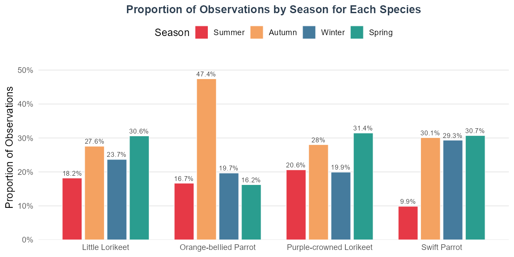
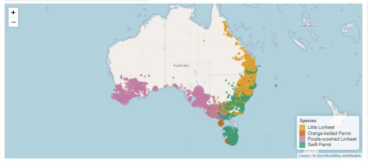

# Australian Parrot Observations — Interactive R Shiny Dashboard

An R Shiny dashboard for exploring where and when four Australian parrot and lorikeet species were recorded between 2004 and 2024, combining a linked Leaflet map with a seasonal comparison chart.

**Stack:** R · Shiny · Leaflet · ggplot2 · dplyr

---

## Question

Species observation records are a long list of coordinates and dates — hard to read directly. The dashboard answers two questions visually: **how does each species' activity split across the four seasons**, and **where are those observations on the map** once you filter to a single species or season.

## Data

[Atlas of Living Australia](https://www.ala.org.au) occurrence records supplied for the unit, retrieved 24 March 2026, CC BY 4.0. Committed as `ALA_PE2S12026.csv` (6.8 MB, 39,486 rows).

| Species | Records |
|---|---|
| Swift Parrot | 13,805 |
| Little Lorikeet | 12,801 |
| Purple-crowned Lorikeet | 12,646 |
| Orange-bellied Parrot | 234 |

Fields used: observation date, state, latitude, longitude, common name.

## Design Decisions

- **Months mapped to Australian seasons** (summer = Dec–Feb) rather than calendar quarters, so the seasonal pattern lines up with the species' actual breeding and migration cycle.
- **Proportions, not counts, in the chart.** The Orange-bellied Parrot has only 234 records against the Swift Parrot's 13,805; raw counts would make it invisible. Each species is normalised to its own total so the four are comparable.
- **Coordinates rounded to 2 decimals** before aggregating, which collapses repeat sightings at one site into a single marker and avoids drawing tens of thousands of overlapping circles.
- **Marker radius scaled by √count** and clamped to 3–15 px, so dense sites stay readable instead of swamping the map.
- **Base map rendered once, markers updated via `leafletProxy`**, so changing a filter redraws only the markers rather than rebuilding the whole map.

## Dashboard

Seasonal split per species:



Geographic distribution, filterable by species and season:



## Findings

1. **The Swift Parrot's records shift between Tasmania and the mainland.** Tasmania holds 94% of its summer records and 76% of its spring records, while 97–98% of its autumn and winter records come from mainland states — the breeding-to-wintering movement, visible directly in the data.
2. **The Orange-bellied Parrot is both rare and seasonally concentrated.** 234 records in total, 47% of them in autumn, almost all from Tasmania (144) and Victoria (71).
3. **The two lorikeets are recorded year-round**, peaking in spring (31%) and dipping in summer (18–21%), consistent with resident rather than migratory species.

## Running It

```r
install.packages(c("shiny", "leaflet", "dplyr", "ggplot2", "scales"))
shiny::runApp()
```

The app reads `ALA_PE2S12026.csv` from the repository root.

> **Note on the base map.** The app requests CartoDB Positron tiles, which now require a CARTO API key — without one the tiles render with a watermark. For a key-free base map, swap the provider in `app.R`:
> ```r
> addProviderTiles(providers$OpenStreetMap.Mapnik)
> ```
> The map screenshot above was taken with OpenStreetMap tiles for that reason. The data layer is identical either way.

## Repository

```
app.R                   Shiny application: data preparation, UI and server
ALA_PE2S12026.csv       observation records (CC BY 4.0)
figures/                images used in this README
```

## Context

Individual programming exercise for FIT5147 Data Exploration and Visualisation, Monash University Malaysia, April 2026. `app.R` is the submitted script (originally `PE2_parrot_visualisation.R`), unchanged apart from the author comment.
